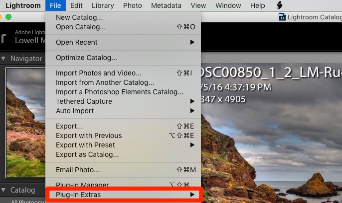
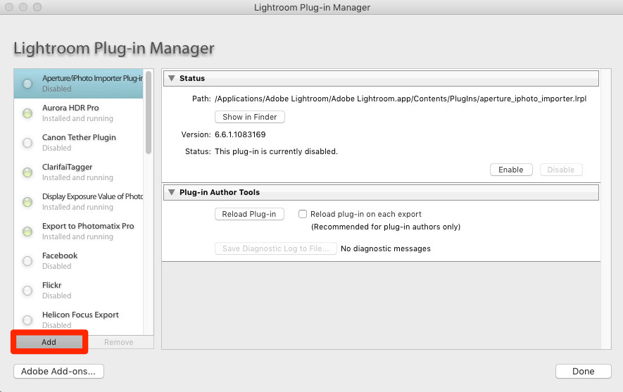
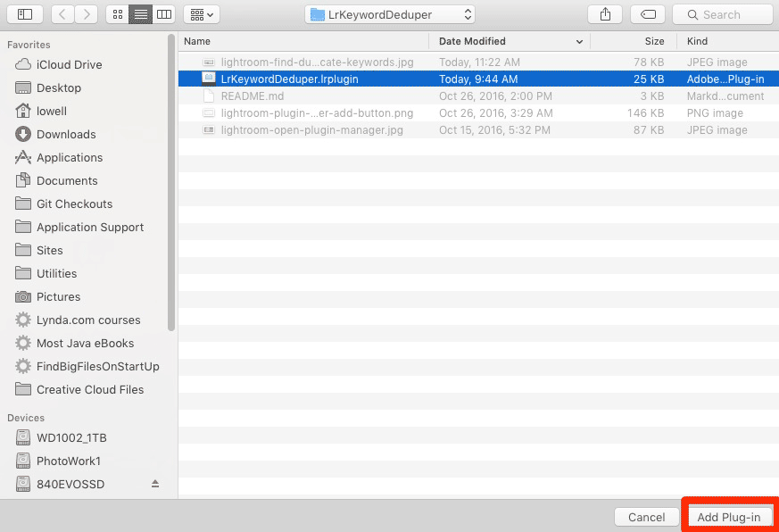
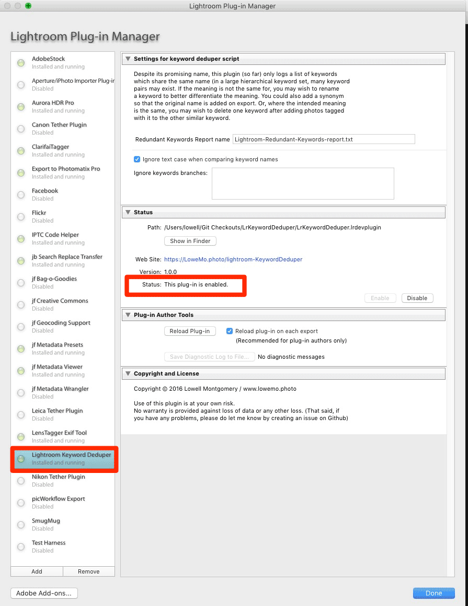
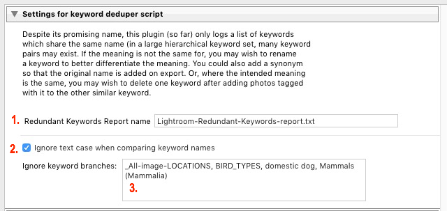
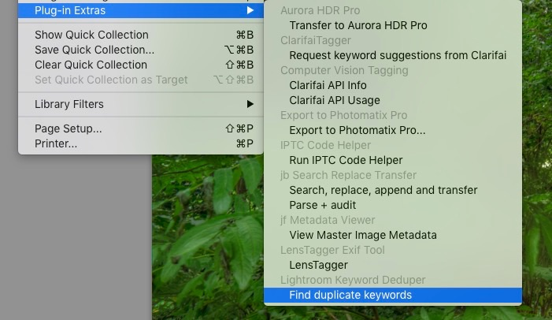

# LrKwDeduper - (Lightroom Keyword Deduper)
The lofty goal for this project is to build up functionality which helps streamline the workflow of merging duplicate keywords (keywords by the same name and with the same meaning/context in a hierarchical keyword list); this is easier said than done. Providing a "merge function" for keywords has long been one of the most requested features, but Adobe still has not implemented a built-in way of doing it, and the support they have for developers to operate on keywords is actually still a bit too limited to do anything in a very ideal manner.

Currently, this plugin only *identifies* duplicate keywords and prints out a report that includes the number of photos associated with each keyword, any synonyms and/or child terms, and the "ancestry path" for each keyword (parent terms up to the top level).

## The problem: Duplicate keywords cause fragmentation in searches
 My personal interest when designing this plugin was to improve the structure of my keyword vocabulary by finding any areas of unintended overlap in my keyword hierarchy and merging them, wherever possible. The main purpose was that then I could use AI auto-tagging solutions, tweaked to work with a hierarchical keyword list, with as few duplicate terms as possible.
 
## Installing the Lightroom Keyword Deduper Lightroom plugin
Installing and using this plugin is the same as for any other Lightroom plugin, so you may already know what to do, but I will still outline the installation process:

### Adding a plugin via the Plugin Manager
If you add a new plugin to the standard directory in Mac or Windows, Lightroom should recognize the new plugin and it will already be shown as "Installed and running" when you open the Plugin Manager.

:point_right: On a Mac, that’s the `~/Library/Application Support/Adobe/Lightroom/Modules` directory.

:point_right: On Windows, it should be `C:\Users\your-username\AppData\Roaming\Adobe\Lightroom\Modules`.

It’s possible that the `Modules` directory does not already exist. If so, you can create it.

Alternatively, you can use the Plugin Manager to install a Lightroom plugin which is stored in any directory accessible to the user:

1. Start Lightroom
2. Open `File > Plug-in Manager…`



3. Click on the `Add` button


4. Locate the plugin, wherever you have downloaded it (here in a sub-folder within my Downloads directory)


5. You should now see that the plugin is “installed and running”


## Preparing to use the Lightroom Keyword Deduper
For now, settings for this plugin are only visible in the Plugin Manager and are fairly limited. In the future, it may be that a UI will be available to help with merging keyword pairs (including synonyms, photo assignments, etc), but Adobe's Lightroom API does not provide a way for plugin developers to actually delete a keyword or to re-assign a keyword's parent, so whatever the future holds, there are some serious limitations to what a plugin like this one could do. For now, though, hopefully you'll find this plugin to be helpful if you need an overview of what might need some work.

### Settings in the Lightroom Plugin Manager


There are currently only three settings for the plugin:
1. The report name (default is `Lightroom-Redundant-Keywords-report.txt`) Generated reports will show up on the desktop.
2. `Ignore text case when comparing keyword names` Keeping this selected (default setting) means that "dog" and "Dog" will "match" as duplicate keywords. You probably will not want to change this behavior, but you can uncheck this box if you do wish to.
3. `Ignore keyword branches` Provides a text area where you may enter a comma-separated list of keyword branches to ignore when generating your report. These are keywords which, when analyzing your keyword hierarchy will be skipped over, including all descendants (child keywords, etc). You might, for instance, have long lists of bird names or plant names which produce matches against terms that are totally unrelated. Or you might have location-specific keyword hierarchies, with multiple sub-location keywords called "downtown". If you can, it may still help your keywording workflow to change some names of such matching terms (you could put the original name in as a synonym). Doing so may help various automations and help in searches for a keyword using Lightroom's "filter". In any case, entering appropriate terms here can improve performance (time required to generate the report) and improve the relevance of results, so you can focus on particular areas of your keyword hierarchy.

## Using the Lightroom Keyword Deduper Lightroom Plugin
Once the plugin is configured and running, it’s simply a matter of selecting the menu item, `Library > Plugin Extras > Find duplicate keywords`



After a moment or two, perhaps longer if you have a really long keyword list, you should see the message that the process has completed including the number of "duplicate keyword" groups which were found. You should find a report on your desktop named according to your setting (by default: `Lightroom-Redundant-Keywords-report.txt`)

For each keyword, the report includes parents/ancestors, synonyms, the number of photos which are tagged with the keyword, and at least a partial list of children, if any. Following is an example excerpt from such a report:

```
Redundant term 2: "summer"
    In: _Season-and-time | _SEASON with 87 photos
    In: new keywords with 22 photos

Redundant term 3: "analysis"
    In: _IPTC-GENRE with 0 photos
    In: _IPTC-MEDIA-SUBJECT | science and technology | research with 0 photos

```
